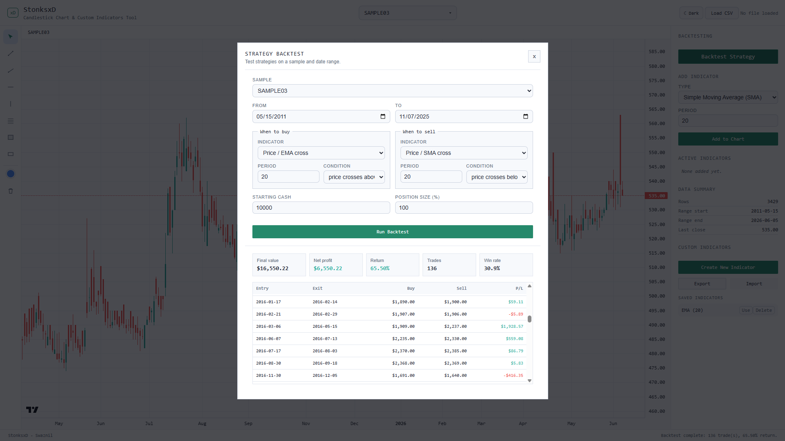

# stonksxd

StonksxD is a technical analysis platform that allows users to to build, visualize, and backtest custom indicators. It is made with vanilla HTML, CSS and JavaScript. It lets you load OHLCV CSV data, view candlestick charts, add indicators, create custom formula indicators and draw directly on the chart.

StonksxD is both a learning project and a practical useful tool. I have been using this to create my own
custom indicator in intuitive and simple way which required a paid plan on other platforms.


## Motivation

I found a competition about building stock market indicators, and my interest was sparked because of the ability of custom indicators without complex pine scripts and so decided to design one for myself. In order to understand the mechanics and design one for myself, I started making stonksxd. I didn't know how to start when I first started working on this project so I made an AI agent build a demo version of the system for me, once I understood the flow and developed a mental map, I started working on the project, making it better by myself.

Once I finished the custom indicator part of it and got everything running properly, it started to feel pointless and boring as just another wannabe trading chart. So I started thinking and came up with an idea which was to add a backtesting engine. The platform that I was supposed to make the custom indicator for does not have such functionality so I made it in order to be able to test my own trading strategy. To have the real data for testing, I scraped some data from some random companies on the NEPSE.


## Live Demo

Project can be run by cloning the repository and opening it with a local server, or directly through the link:

stonksxd.vercel.app

---

## Features

- Load candlestick chart from CSV file
- Analyse the chart with built in Indicators
- Create, import, export custom indicators
- Premade indicators such as: SMA, EMA, Bollinger Bands, RSI, MACD, ATR, VWAP, and more
- Backtest indicator based strategies
- Drawing tools including: trend lines, rays, horizontal lines, Fibonacci retracements, and other annotations
- Dark and light theme

---

## Built In Indicators

- Simple Moving Average (SMA)
- Exponential Moving Average (EMA)
- Bollinger Bands
- Volume
- RSI
- MACD
- ATR
- VWAP
- Stochastic

---

## Drawing Tools

- Trend line
- Ray
- Horizontal line
- Vertical line
- Rectangle
- Fibonacci retracement
- Text labels
- Delete and clear drawing controls

---

## Screenshots





---

## CSV Format

The CSV loader expects data in this format:

```text
published_date,open,high,low,close,traded_quantity
```

Required columns:

- `published_date`
- `open`
- `high`
- `low`
- `close`

Optional column:

- `traded_quantity`

`traded_quantity` is used for volume if it is available.

---

## Tech Stack

- HTML
- CSS
- JavaScript
- Lightweight Charts
- Papa Parse

---

## Project Structure

```text
stonksxd
├── README.md
├── assets
│   ├── screenshotchart.png
│   └── screenshotindicator.png
├── css
│   ├── backtest.css
│   ├── base.css
│   ├── components.css
│   └── custom-indicator.css
├── data
│   ├── sample01.csv
│   ├── sample02.csv
│   ├── sample03.csv
│   ├── sample04.csv
│   └── sample05.csv
├── index.html
└── js
    ├── app.js
    ├── backtest.js
    ├── chart.js
    ├── data.js
    ├── drawing-tools.js
    └── indicators.js
```

---

## How It Works

Data loading is done via the use of CSV files through Papa Parse. The data is then converted into daily candlestick data and rendered on the chart with the help of Lightweight Charts.

Candle consists of OHLC data (open, high, low, close). Indicators provided by the library are computed with the use of JavaScript. Some of them are drawn directly on top of the price chart, whereas others are shown in a separate pane. Custom indicators can be built through the use of OHLC and volume data, along with such functions as SMA, EMA, RSI, ATR, MAX, MIN, STDEV, and ABS. Drawings are done independently of indicators. Small preferences such as selected stock, theme and custom indicators are stored in LocalStorage of the browser.

---

## AI Usage

ChatGPT and Codex were used for debugging code, helping build chart logic, indicator calculations and improving code structure. I used AI agent to build me a intial working prototype as I was really confused on where and how to start, after that I added more features and made improvements myself.
All project decisions, design choices, implementation and final testing were done by me.

---