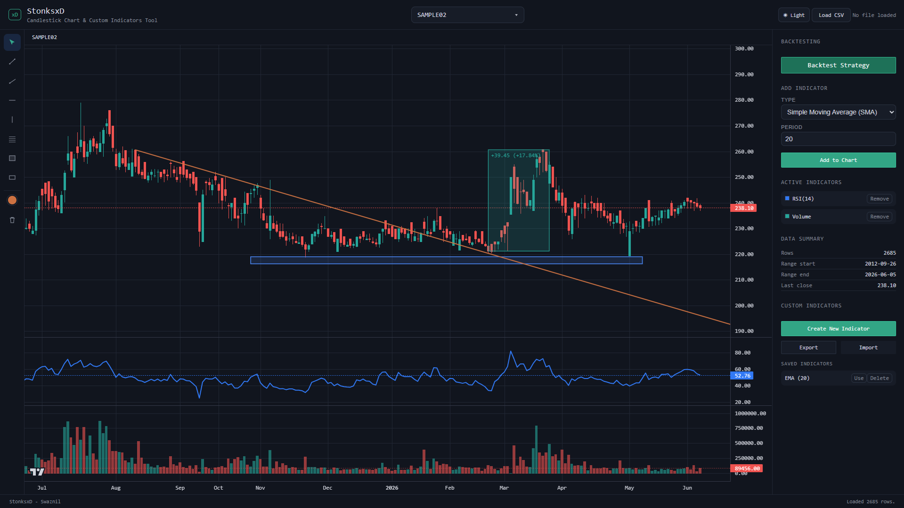
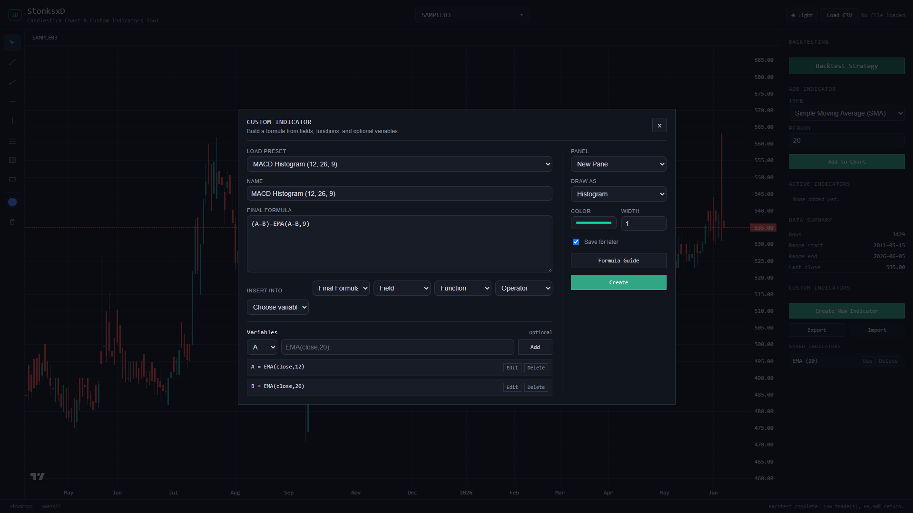

# stonksxd

StonksxD is a browser based candlestick charting and stock data playground made with vanilla HTML, CSS and JavaScript. It lets you load OHLCV csv data, view candlestick charts, add indicators, create custom formula indicators and draw directly on the chart.

The project is meant to be lightweight and simple to run. There is no backend, no account system, no build step and no framework setup needed.


## Motivation

I wanted to make a clean stock chart where I could load my own data, create custom indicators and in the process learn more about financial charts, technical analysis indicators and building interactive browser tools. 

## Live Demo

Project can be run by cloning the repository and opening it with a local server, or directly through the link:

```text
stonksxd.vercel.app
```

---

## Features

- Load the included sample stocks or import your own CSV file
- Show candlesticks with OHLC and volume data
- Add SMA, EMA, Bollinger Bands, RSI, MACD, ATR, VWAP, and Stochastic indicators
- Save, import, and export custom indicators
- Add trend lines, rays, horizontal lines, Fibonacci retracements, and other chart annotations
- Dark and light theme support

---

## Built In Indicators

- Simple Moving Average (SMA)
- Exponential Moving Average (EMA)
- Bollinger Bands
- Volume
- RSI
- MACD
- ATR
- VWAP
- Stochastic

---

## Drawing Tools

- Trend line
- Ray
- Horizontal line
- Vertical line
- Rectangle
- Fibonacci retracement
- Text labels
- Delete and clear drawing controls

---

## Screenshots






---

## CSV Format

The csv loader expects data in this format:

```text
published_date,open,high,low,close,traded_quantity
```

Required columns:

- `published_date`
- `open`
- `high`
- `low`
- `close`

Optional column:

- `traded_quantity`

`traded_quantity` is used for volume if it is available.

---

## Tech Stack

- HTML 5
- CSS
- JavaScript
- LocalStorage
- Lightweight Charts
- Papa Parse

---

## Project Structure

```text
stonksxd/
|
|-- index.html
|-- app.js
|-- indicators.js
|-- drawing-tools.js
|-- style.css
|-- custom-indicator.css
|-- README.md
|
`-- data/
    |-- sample01.csv
    |-- sample02.csv
    |-- sample03.csv
    |-- sample04.csv
    `-- sample05.csv
```

---

## How It Works

The app loads stock data from csv files using Papa Parse. The data is converted into daily candlestick format and then rendered on the chart using Lightweight Charts.

Each candle contains open, high, low and close values. Built in indicators are calculated in JavaScript from the loaded candle data. Some indicators are drawn directly over the price chart, while others are displayed in their own pane. Custom indicators can be build using using fields like `open`, `high`, `low`, `close` and `volume`, along with functions like `SMA`, `EMA`, `RSI`, `ATR`, `MAX`, `MIN`, `STDEV` and `ABS`.

Drawings are handled separately from the indicators, so you can mark up the chart using lines, rays, rectangles, fibonacci retracements and text labels. Small preferences like selected stock, chart range, theme and custom indicators are saved in browser LocalStorage.

---

## AI Usage

ChatGPT and Codex were used for:

- Debugging JavaScript code
- Discussing chart logic and indicator calculations
- Improving code structure
- Cleaning up UI and styles

All project decisions, design choices, implementation and final testing were done by me.

---